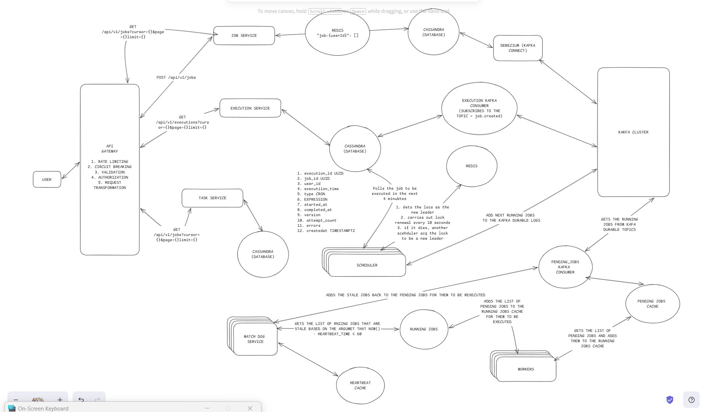

# Hyperscale-Job-Scheduler
A distributed job scheduler built with focus on handling 100k jobs within 2 seconds using Nodejs, Typescript, Kakfa, Cassandra, Debezium, and Redis

## Table Of Contents
1